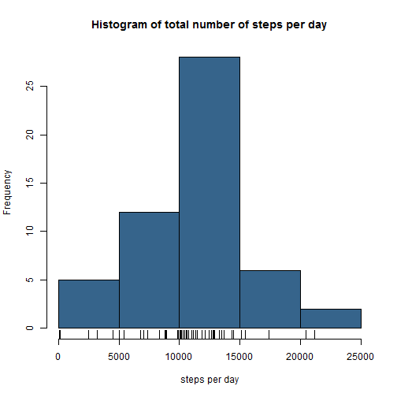
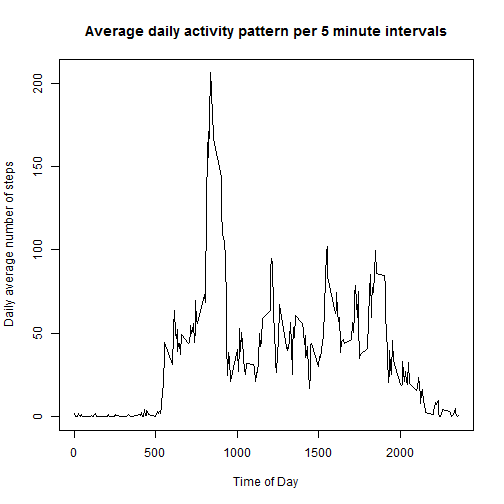
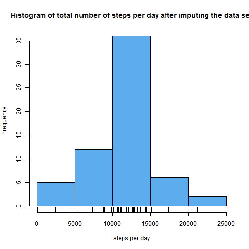
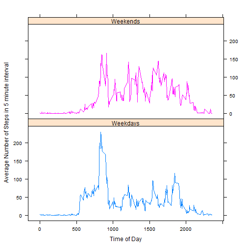

Reproducible Research: Peer Assignment 1
======
##Loading and preprocessing the data 
The data for this assignment comes from an activity monitor device. The device measures the number of steps taken for an anonymous person at a 5 minute interval. This has been recorded for the months of October and November in 2012. 

```r
rawdata <- read.csv(file="activity.csv")
data <- rawdata[complete.cases(rawdata),]
```
## What is mean total number of steps taken per day?
From the data we take a look at the histogram (we ignore the missing values for now).

```r
stepsperday <- tapply(data$steps,data$date,sum)
mean <- mean(stepsperday,na.rm=T)
median <- median(stepsperday,na.rm=T)
hist(stepsperday,main="Histogram of total number of steps per day", xlab="steps per day",col = "steelblue4")
rug(stepsperday)
```



The mean and median of the total number of steps per day are 10766.19 and 10765, respectively. 

## What is the average daily activity pattern?
We would like to see what the average daily activity pattern looks like for this person. The next plot is a time series for one day, but please bear in mind there are some missing values in our data set. 

```r
splitted <- split(data$steps,data$interval)
Average <- sapply(splitted,mean)
plot(data$interval[1:288], Average,type="l",xlab= "Time of Day",main="Average daily activity pattern per 5 minute intervals",ylab="Daily average number of steps")
```



There is a maximum of 206 steps at the 104-th 5 minute interval. This corresponds to 8:30-8:35 AM.

## Imputing missing values
Note that there are a number of days/intervals where there are missing values. The presence of missing days may introduce bias into some calculations or summaries of the data. The number of missing values is:

```r
sum(is.na(rawdata$steps))
```

```
## [1] 2304
```
Or, as seen as a percentage of the total number of values:

```r
p <- sum(is.na(rawdata$steps)) / length(rawdata$steps) * 100
format(p,digits=4)
```

```
## [1] "13.11"
```
To (hopefully) get a better data set we impute the missing values with the mean of the corresponding 5 minute interval.

```r
imputedSteps <- rawdata$steps
imputedSteps[is.na(rawdata$steps)]<-rep(Average,61)[is.na(rawdata$steps)]
imputedData <- rawdata
imputedData[,1] <- imputedSteps
```
and make a new histogram:

```r
newstepsperday <- tapply(imputedData$steps,imputedData$date,sum)
newmean <- mean(newstepsperday)
newmedian <- median(newstepsperday)
hist(newstepsperday,main="Histogram of total number of steps per day after imputing the data set", xlab="steps per day",col = "steelblue2")
rug(newstepsperday)
```



The new mean and new median of the total number of steps per day are 10766.19 and 10766.19, respectively. 
If we compare the new mean with old mean we see that nothing has changed. This is completely as expected, since we added the mean of the old data.
If we compare medians we see that the value has shifted towards the new mean, which also was to be expected. We also note the equivalence of the mean and median. It seems likely that the new median is an imputed value. 

## Are there differences in activity patterns between weekdays and weekends?
Due to the fact most people undertake different activities during weekdays and weekends, like going to school, practicing sports or having a job, it makes sense to look at the difference in average activity during the weekdays and the weekends.

```r
weekDays <- weekdays(as.Date(imputedData$date))
weekendlogi <- grepl("z",weekDays) 
  ##  In Dutch, only the names for Saturday and Sunday contain a 'z'. If one uses
  ##  say English weekdays, one has to change this part of the code. One could, e.g.,
  ##  use that in English weekend days start with an 'S'.

Weekendfactor<-factor(weekendlogi,labels=c("Weekday","Weekend")) 
  ##  Note the order of the labels. As our data set starts with monday,
  ##  our label lists "Weekday" first. 

imputedData[,4] <- Weekendfactor 
```

Now we split the data by interval and weekday and calculate the mean.

```r
splittedData <- with(imputedData,split(steps,list(interval,Weekendfactor)))
meansplit <- lapply(splittedData,mean)
```
And plot it:

```r
gl <-gl(2,288,labels = c("Weekdays","Weekends"))
library(lattice)
xyplot(as.numeric(meansplit)~imputedData$interval[1:288]+imputedData$interval[289:576]|gl,type="l",layout=c(1,2),xlab = "Time of Day",ylab = "Average Number of Steps in 5 minute interval")
```



The average number of steps in the mornings during the weekdays is increased as compared to mornings in the weekends. However, the total activity during the afternoon seems to be a little lower during the weekdays.
